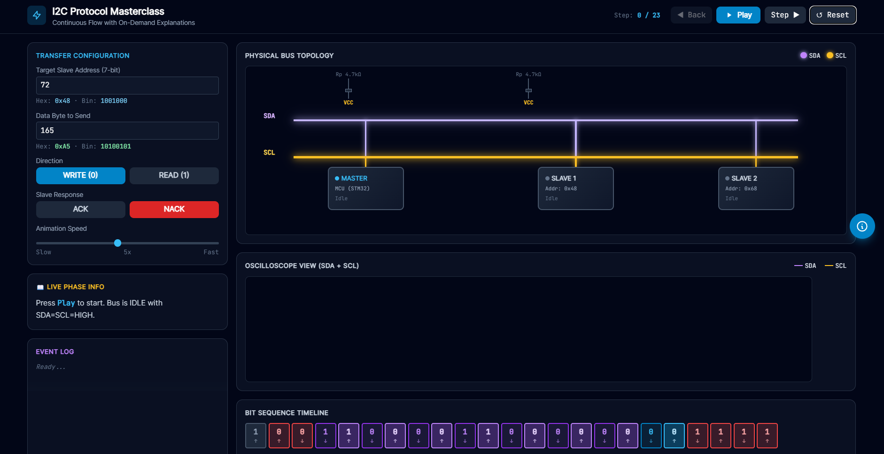
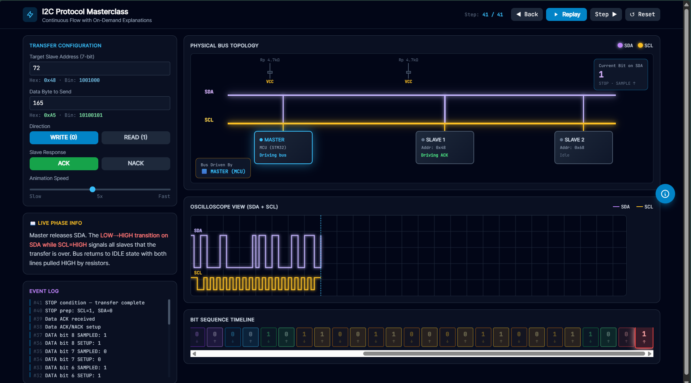

# 🔌 I2C Protocol Interactive Simulator

**An interactive, browser-based simulator for learning the I2C communication protocol from the ground up.**

[Live Demo](#-live-demo) • [Features](#-features) • [How to Use](#-how-to-use) • [Technical Details](#-technical-details) • [Deployment](#-deployment)

---
## 🚀 Live Demo

**🔗 Try it live:** [https://asifahamed-ece.github.io/I2C_Simulator/](https://asifahamed-ece.github.io/I2C_Simulator/)

---

## 📖 Overview

This simulator provides a **visual, interactive learning experience** for understanding the I2C (Inter-Integrated Circuit) protocol — one of the most widely used communication protocols in embedded systems.

Unlike static diagrams, this tool lets you **see every bit being transmitted in real-time**, with detailed explanations at each step. It's designed specifically for **ECE students and embedded systems enthusiasts** who want to move beyond theory and actually *see* how I2C works at the hardware level.

---

### 🎯 What You'll Learn

- How the **START** and **STOP** conditions are generated
- The role of **pull-up resistors** (4.7kΩ) on the bus
- How **7-bit addressing** works (MSB first)
- The difference between **SETUP** (SCL=0) and **SAMPLE** (SCL=1) phases
- How **ACK/NACK** handshaking works between Master and Slave
- The complete **bit-by-bit data transfer** sequence
- Real-time **oscilloscope-style waveform** visualization

---

## ✨ Features

### 🎨 Visual Interface
- **Physical Bus Topology Diagram** — See the Master MCU, two Slaves (TMP102 @ 0x48, MPU6050 @ 0x68), and the shared SDA/SCL bus with pull-up resistors
- **Real-time Oscilloscope View** — Watch SDA (purple) and SCL (amber) waveforms update in real-time as the protocol executes
- **Bit Sequence Timeline** — Visual representation of every bit transmitted, color-coded by phase (Address, R/W, ACK, Data, etc.)
- **Wire Pulse Animations** — Glowing effects on wires when state changes occur
- **Edge Indicators** — Visual markers showing rising (↑) and falling (↓) clock edges

### ⚙️ Interactive Controls
- **Configurable Slave Address** — Set any 7-bit address (0-127) in decimal, see hex and binary representations
- **Custom Data Byte** — Send any byte (0-255) and watch it transmit bit-by-bit
- **Direction Toggle** — Switch between WRITE (Master→Slave) and READ (Slave→Master) modes
- **ACK/NACK Simulation** — Test both successful and failed acknowledgments
- **Adjustable Animation Speed** — From slow step-by-step (1x) to fast continuous flow (10x)
- **Play/Pause/Step Controls** — Full control over the simulation progression

### 📚 Educational Features
- **Live Phase Explanations** — Detailed text explanations update with each step
- **On-Demand Info Panel** — Click the floating "i" button (or press `I`) to get deep-dive explanations of the current step
- **Event Log** — Chronological record of all bus events
- **Current Bit Badge** — Always shows which bit is currently on the SDA line
- **Driver Indicator** — Shows whether Master or Slave is currently driving the bus

### ⌨️ Keyboard Shortcuts
| Key | Action |
|-----|--------|
| `Space` | Play / Pause |
| `→` (Right Arrow) | Step Forward |
| `←` (Left Arrow) | Step Backward |
| `R` | Reset Simulation |
| `I` | Toggle Info Panel |
| `Esc` | Close Info Panel |

---

## 🖼️ Screenshots

<table>
<tr>
<td> <em>Bus in IDLE state</em></td>
<td> <em>Active data transfer</em></td>
</tr>
</table>

---

## 📋 How to Use

### Basic Usage

1. **Open the simulator** in any modern web browser
2. **Configure your transfer:**
   - Enter a target slave address (e.g., `72` for 0x48)
   - Enter a data byte to send (e.g., `165` for 0xA5)
   - Select direction: WRITE or READ
   - Choose slave response: ACK or NACK
3. **Click "Play"** to watch the complete I2C transaction unfold
4. **Use "Step"** buttons to go through the protocol one step at a time
5. **Click the floating "i" button** (or press `I`) to see detailed explanations

### Understanding the Visualization

#### The Bus Diagram
- **Purple wire** = SDA (Serial Data Line)
- **Amber wire** = SCL (Serial Clock Line)
- **Glowing chips** = Currently active device
- **Blue border** = Master is driving the bus
- **Green border** = Addressed slave is responding

#### The Oscilloscope
- Watch how **SDA changes only when SCL is LOW** (this is a fundamental I2C rule!)
- Observe the **START condition**: SDA falls while SCL is HIGH
- Observe the **STOP condition**: SDA rises while SCL is HIGH
- See the **ACK bit**: Slave pulls SDA LOW during the 9th clock pulse

#### The Timeline
Each cell represents one state of the bus:
- **Red cells** = START/STOP conditions
- **Purple cells** = Address bits
- **Sky blue cells** = R/W bit
- **Green cells** = ACK bits
- **Amber cells** = Data bits
- **↑** = Rising edge (sampling)
- **↓** = Falling edge (setup)

---

## 🔬 Technical Details

### I2C Protocol Implementation

The simulator accurately models the I2C protocol according to the NXP I2C specification:

| Phase | Bits | Description |
|-------|------|-------------|
| **START** | - | SDA ↓ while SCL = 1 |
| **Address** | 7 bits | Slave address, MSB first |
| **R/W** | 1 bit | 0 = Write, 1 = Read |
| **ACK** | 1 bit | Slave pulls SDA LOW (ACK = 0) |
| **Data** | 8 bits | Data byte, MSB first |
| **ACK** | 1 bit | Acknowledgment of data |
| **STOP** | - | SDA ↑ while SCL = 1 |

### Key Implementation Highlights

1. **Checkpoint-Based Simulation**: Each bit transmission is broken into SETUP (SCL=0) and SAMPLE (SCL=1) checkpoints, ensuring accurate clock behavior.

2. **Canvas Waveform Rendering**: The oscilloscope uses HTML5 Canvas for smooth, real-time waveform drawing with proper edge transitions.

3. **State-Driven UI**: All visual elements (wires, chips, badges) update based on the current simulation state, ensuring consistency.

4. **Responsive Design**: Works on desktop and tablet screens using Tailwind's responsive grid system.

---

## 🛠️ Technologies Used

| Technology | Purpose |
|------------|---------|
| **HTML5** | Semantic structure |
| **Tailwind CSS** (CDN) | Utility-first styling |
| **Vanilla JavaScript** | Simulation logic, DOM manipulation |
| **HTML5 Canvas** | Oscilloscope waveform rendering |
| **Inter Font** | UI typography |
| **JetBrains Mono** | Monospace code/technical text |

### No Build Step Required!
This is a **single-file application** — no npm, no webpack, no build process. Just open `index.html` in a browser and it works!

---

## 📦 Deployment

### GitHub Pages 
1. Create a new repository on GitHub
2. Upload `index.html`
3. Go to **Settings → Pages**
4. Select **Branch: main** and **Folder: / (root)**
5. Click **Save**
6. Your site will be live at `https://YOUR_USERNAME.github.io/REPO_NAME/`

## 🎓 Learning Resources

To get the most out of this simulator, pair it with:

- [NXP I2C Specification](https://www.nxp.com/docs/en/user-guide/UM10204.pdf) — The official I2C standard
- [STM32 I2C Application Note](https://www.st.com/resource/en/application_note/an2804-stm32f10xxx-hardware-i2c-stmicroelectronics.pdf) — How I2C is implemented in STM32
- [SparkFun I2C Tutorial](https://learn.sparkfun.com/tutorials/i2c) — Great beginner-friendly explanation
- [Philips I2C Bus Specification](https://www.ti.com/lit/an/slva704/slva704.pdf) — Classic reference document

---

## 🤝 Contributing

This is an educational project, but contributions are welcome! If you have ideas for:
- Additional protocol features (10-bit addressing, clock stretching)
- Bug fixes
- UI improvements
- Documentation enhancements

Feel free to open an issue or submit a pull request.

---

## 📄 License

This project is open source and available under the [MIT License](LICENSE).

---

## 👨‍💻 Author

**Asif Ahamed**  
Final Year ECE Student | Embedded Systems Enthusiast  
🏫 Rajalakshmi Engineering College

- 🐙 GitHub: [@asifahamed-ece](https://github.com/asifahamed-ece)
- 💼 LinkedIn: [Asif Ahamed](https://linkedin.com/in/asif-ahamed-s-ece)

---

## 🙏 Acknowledgments

- Inspired by the need for better visual learning tools in embedded systems education
- Built with the help of AI-assisted development
- Thanks to the open-source community for Tailwind CSS and the amazing fonts

---

## 📊 Project Status

✅ **Active Development** — Currently working on:
-  SPI Protocol Simulator
-  UART Protocol Simulator  
-  Combined Protocol Comparison Tool
-  Real hardware integration examples (STM32, ESP32 code snippets)

---

**⭐ If this project helped you understand I2C, consider giving it a star on GitHub! ⭐**

*Made with ❤️ for the embedded systems community*

